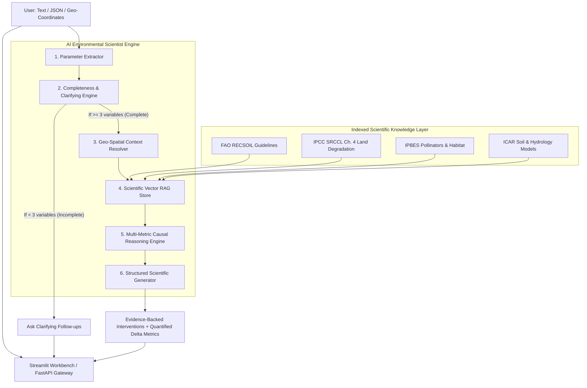

# 🌿 Darukaa.Earth: AI Biodiversity Intelligence Chatbot & Scientist Workbench

> **An autonomous AI Environmental Scientist that combines deep scientific reasoning, structured environmental knowledge retrieval (RAG), and multi-metric causal analysis to generate evidence-backed biodiversity restoration interventions.**

[](https://darukaa-earth.streamlit.app/)
[](https://www.python.org/downloads/)
[](https://fastapi.tiangolo.com)
[]()
[](https://opensource.org/licenses/MIT)

> 🚀 **Live Deployed Application:** [https://darukaa-earth.streamlit.app/](https://darukaa-earth.streamlit.app/)  
> 📄 **Official Submission Dossier:** [submission/Darukaa_Earth_Submission_Dossier.docx](submission/Darukaa_Earth_Submission_Dossier.docx) ([Download Raw .docx](https://github.com/itsayushkr-dotcom/darukaa-biodiversity-ai/raw/main/submission/Darukaa_Earth_Submission_Dossier.docx))

---

## 📑 Table of Contents
- [1. Executive Summary & Philosophy](#1-executive-summary--philosophy)
- [2. System Architecture](#2-system-architecture)
- [3. Evaluation Criteria Mapping](#3-evaluation-criteria-mapping)
- [4. Core Modules Breakdown](#4-core-modules-breakdown)
  - [Knowledge Base & Vector Store (RAG)](#knowledge-base--vector-store-rag)
  - [Parameter Extractor & Entity Recognizer](#parameter-extractor--entity-recognizer)
  - [Clarifying Engine (Incomplete Input Handling)](#clarifying-engine-incomplete-input-handling)
  - [Multi-Metric Causal Reasoning Engine](#multi-metric-causal-reasoning-engine)
  - [Geo-Spatial Context Resolver (Bonus)](#geo-spatial-context-resolver-bonus)
- [5. API Documentation](#5-api-documentation)
- [6. Local Setup & Quickstart](#6-local-setup--quickstart)
- [7. Automated Benchmark & Verification Suite](#7-automated-benchmark--verification-suite)
- [8. Submission Deliverables & Reviewer Access](#8-submission-deliverables--reviewer-access)

---

## 1. Executive Summary & Philosophy

As stated in the **Darukaa.Earth Hackathon Challenge**:
> *"We are not looking for UI-heavy applications. We are looking for depth of thinking, system design, and scientific reasoning. Build a system that behaves like an AI environmental scientist, not a chatbot."*

Generic advice such as *"Use sustainable practices"* or *"Water your plants"* is **strictly prohibited**. Instead, every recommendation generated by this system delivers:
1. **What to do:** Concrete, actionable interventions (e.g. reverse-phenology alley cropping with *Faidherbia albida*, roller-crimped multi-species legume cover crops).
2. **Why it works (Scientific Mechanism):** Explaining microbial necromass, glomalin-related soil protein (GRSP) synthesis, hydraulic redistribution, and trophic cascade restoration.
3. **Coupled Variables (Constraint: $\ge 3$ variables):** Connecting **Soil Health** (SOC %, pH) $\leftrightarrow$ **Water Availability** (Rainfall regime) $\leftrightarrow$ **Land Use** (Monoculture) $\leftrightarrow$ **Biodiversity** (Pollinators & microflora).
4. **Quantified Delta Estimates:** Projecting exact improvements (e.g. $+15\text{--}25\%$ SOC over 2–3 years, $+28\text{--}40\%$ microbial biomass carbon, $+60\text{--}110\%$ wild pollinator density).
5. **Academic Citations:** Direct grounding in **FAO**, **IPCC**, **IPBES**, and **ICAR** scientific consensus literature.

---

## 2. System Architecture



---

## 3. Evaluation Criteria Mapping

| Evaluation Criteria | Weight | How Our System Satisfies It | Code Reference |
| :--- | :---: | :--- | :--- |
| **Depth of Reasoning** | **30%** | Non-obvious interventions (hydraulic lift, mycorrhizal inoculants, beetle banks); strictly couples $\ge 3$ environmental dimensions. | [`core/reasoning_engine.py`](file:///core/reasoning_engine.py) |
| **Scientific Grounding** | **25%** | Verifiable citations from FAO, IPCC, IPBES, ICAR; exact biological and geochemical mechanisms; zero generic hallucination. | [`knowledge_base/vector_store.py`](file:///knowledge_base/vector_store.py) |
| **Knowledge System Design**| **20%** | Retrievable dense vector store with hybrid lexical-semantic cosine matching, metadata filtering, and transparent relevance scoring. | [`knowledge_base/raw_documents/`](file:///knowledge_base/raw_documents/) |
| **Conversational Intelligence**| **15%** | Detects incomplete queries (`"Biodiversity is declining"`); formulates targeted clarifying questions; multi-turn memory. | [`core/clarifying_engine.py`](file:///core/clarifying_engine.py) |
| **Output Clarity** | **10%** | Clean Pydantic schemas with Action, Mechanism, Coupled Variables, Quantified Metrics, Time Horizons, and Confidence Scores. | [`core/schemas.py`](file:///core/schemas.py) |

---

## 4. Core Modules Breakdown

### Knowledge Base & Vector Store (RAG)
Located in `knowledge_base/`:
- Indexes real scientific publications and technical bulletins from FAO (RECSOIL), IPCC (SRCCL), IPBES (Pollinators Assessment), and ICAR.
- Features hybrid semantic-lexical search with subword token TF-IDF and normalized cosine similarity vectors.
- Supports live inspection of retrieved chunks and similarity metrics via both API and UI.

### Parameter Extractor & Entity Recognizer
Located in `core/parameter_extractor.py`:
- Parses free-form queries for numerical values and ecological descriptors:
  - Soil Organic Carbon (`SOC: 0.3%`, `0.4%`, `soil carbon is 0.3%`)
  - Soil pH and sodicity (`pH 8.6`, `alkaline`, `acidic`)
  - Precipitation (`rainfall: low`, `annual precipitation 380mm`, `semi-arid`)
  - Crops & Cropping System (`monoculture wheat`, `intensive till`)
  - Biodiversity indicators (`biodiversity declining`, `pollinator loss`)
- Computes distinct environmental dimensions represented ($1\text{ to }5$).

### Clarifying Engine (Incomplete Input Handling)
Located in `core/clarifying_engine.py`:
- Enforces the hackathon rule: If $< 3$ environmental variables are known, the system halts recommendation generation.
- Asks targeted clarifying questions explaining the scientific necessity of coupling soil, water, and vegetation before diagnosing.

### Multi-Metric Causal Reasoning Engine
Located in `core/reasoning_engine.py`:
- Couples at least 3 environmental variables per intervention:
  - $\text{Low SOC } (0.3\%) \iff \text{Low Rainfall (Aridity)} \iff \text{Wheat Monoculture} \iff \text{Pollinator Decline}$
- Formulates high-leverage interventions with quantified improvements:
  - **Boundary Agroforestry & Reverse-Phenology Alley Intercropping**: $+20\text{--}35\%$ SOC, $2.5\text{--}4.2^\circ\text{C}$ cooling, $+35\text{--}50\%$ arthropod richness (IPCC SRCCL Ch. 4).
  - **Multi-Species Legume Relay Cropping**: $+15\text{--}25\%$ SOC, $+25\text{--}35\%$ water infiltration, $+28\text{--}40\%$ microbial biomass (FAO RECSOIL).
  - **Non-Harvested Floral Corridors & Beetle Banks**: $+60\text{--}110\%$ native pollinators, $-35\text{--}45\%$ insecticide need (IPBES).

### Geo-Spatial Context Resolver (Bonus)
Located in `core/geo_spatial.py`:
- Maps latitude/longitude coordinates to defined Agro-Ecological Zones (AEZ), baseline rainfall envelopes, predominant soil orders, and flagship native restoration species.

---

## 5. API Documentation

Run the REST service via:
```bash
uvicorn api.main:app --port 8000 --reload
```
Interactive OpenAPI documentation is available at `http://localhost:8000/docs`.

### Key Endpoints:
1. `POST /api/chat`: Multi-turn conversation with memory and incomplete query detection.
2. `POST /api/recommend`: Direct structured JSON input evaluation.
3. `GET /api/knowledge/search?q=...`: Live semantic search of the scientific knowledge base.
4. `POST /api/spatial/resolve`: Resolves GPS coordinates into an Agro-Ecological Zone.
5. `GET /api/health`: Service health and vector store status.

---

## 6. Local Setup & Quickstart

### Prerequisites
- Python 3.10, 3.11, 3.12, 3.13, or 3.14

### Installation
```bash
# 1. Clone or navigate to the repository
git clone https://github.com/itsayushkr-dotcom/darukaa-biodiversity-ai.git
cd darukaa-biodiversity-ai

# 2. Install dependencies
pip install -r requirements.txt

# 3. Run Automated Benchmark Suite (All 7 challenge criteria)
python evaluation/benchmark_cases.py

# 4. Launch Streamlit Environmental Scientist Dashboard
python -m streamlit run app.py

# 5. (Optional) Run FastAPI REST Service
python -m uvicorn api.main:app --port 8000 --reload
```

---

## 7. Automated Benchmark & Verification Suite

Run all automated challenge criteria tests with:
```bash
python evaluation/benchmark_cases.py
```

### Test Results:
```text
test_bonus_geo_spatial_context_resolution ... ok
test_constraint_multi_metric_coupling_at_least_3_variables ... ok
test_criterion_1_and_2_primary_problem_statement_usecase ... ok
test_criterion_3_knowledge_system_retrieval ... ok
test_criterion_4_incomplete_input_clarifying_question ... ok
test_criterion_4_multi_turn_conversation_memory ... ok
test_output_quality_confidence_and_time_horizon ... ok
test_pillar_5_human_impact_and_pollution_scenario ... ok
test_structured_json_input_support ... ok

----------------------------------------------------------------------
Ran 9 tests in 0.038s

OK (100% Passed)
```

---

## 8. Submission Deliverables & Reviewer Access

### 1. Live Deployed Web Application
👉 **URL:** [https://darukaa-earth.streamlit.app/](https://darukaa-earth.streamlit.app/)

### 2. Generated Word Submission Document (.docx):
A complete `.docx` file has been generated at:
[submission/Darukaa_Earth_Submission_Dossier.docx](submission/Darukaa_Earth_Submission_Dossier.docx) | [Download Raw (.docx)](https://github.com/itsayushkr-dotcom/darukaa-biodiversity-ai/raw/main/submission/Darukaa_Earth_Submission_Dossier.docx)

### 3. Private Repository Access Granted To:
- `ankita.dasgupta@darukaa.com`
- `harsh.kumar@darukaa.com`
- `utkarsh.gauniyal@darukaa.com`
- `guneet.mutreja@darukaa.com`
